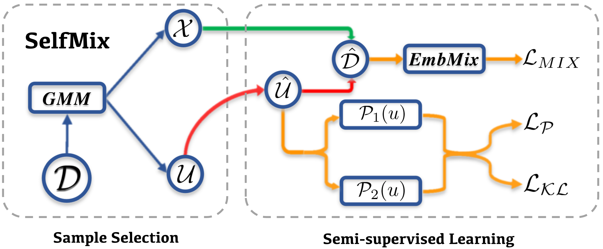

## SelfMix: Robust Learning Against Textual Label Noise with Self-Mixup Training

This repository contains the code and pre-trained models for our paper [SelfMix: Robust Learning Against Textual Label Noise with Self-Mixup Training](https://arxiv.org/abs/2210.04525)

## Quick Links

  - [Overview](#overview)
  - [Datasets](#datasets)
    - [Noise Sample Generation](#noise-sample-generation)
    - [Parameter Setting](#parameter-setting)
  - [Train](#train)
    - [Requirements](#requirements)
    - [Quick Start](#quick-start)
    - [Parameters](#parameters)
  - [Evaluation](#evaluation)
  - [Baselines](#baselines)
  - [Results](#results)

## Overview

We proposes SelfMix, i.e., a self-distillation robust training method based on the pre-trained models.

SelfMix uses GMM to select the samples that are more likely to be wrong and erase their original labels. Then we leverage semi-supervised learning to jointly train the labeled set `X` (contains mostly clean samples) and an unlabeled set `U` (contains mostly noisy samples).



## Datasets

We do experiments on three text classification benchmarks of different types, including Trec, AG-News and IMDB.

| Dataset | Class | Type | Train | Test |
|:--------|:-----:|:----:|:-----:|:-----|
|  Trec | 6 | Question-Type | 5452 | 500 |
| IMDB | 2 | Sentiment Analysis | 45K | 5K |
| AG-News | 4 | News Categorization | 120K | 7.6K |


### Noise Sample Generation

We evaluate our strategy under the following two types of label noise

* Asymmetric noise (Asym): Following [Chen et al.](https://arxiv.org/pdf/1905.05040.pdf), we choose a certain proportion of samples and flip their labels to the corresponding class according to the asymmetric noise transition matrix.
* Instance-dependent Noise (IDN): Following [Algan and Ulusoy](https://arxiv.org/pdf/2003.10471.pdf), we train an LSTM classifier on a small set of the original training data and flip the origin labels to the class with the highest prediction.

You can construct noisy datsets by the following command (e.g., Trec 0.4asym),

```bash
python data/corrupt.py \
    --src_data_path data/trec/train.csv \
    --save_path data/trec/train_corrupted.csv \
    --noise_type asym \
    --noise_ratio 0.4
```

You can generate IDN dataset by the procedures:
1. train an LSTM classifier on a small set of the original training data
2. flip the origin labels to the class with the highest prediction according to [the code repo](https://github.com/gorkemalgan/corrupting_labels_with_distillation/blob/master/noise.py)

### Parameter Setting

We use the following hyperparamters for training SelfMix:

| Data Settings | Trec/AG-News(Asym) | IMDB(Asym) | AG-News/IMDB(IDN) |
|:--------|:-----:|:----:|:-----:|
| `lambda_p` | 0.2 | 0.1 | 0.0 |
| `lambda_r` | 0.3 | 0.5 | 0.3 |
| `class_reg` | False | False | True |

## Train

In the following section, we describe how to train a SelfMix model by using our code.

### Requirements

You should run the following script to install the remaining dependencies first.

```bash
pip install -r requirements.txt
```

### Quick Start

We list some demo config in folder `demo_config`, you can just use the demo config to train,

```bash
python train.py demo_config/trec-bert-asym_train.json
```

### Parameters

Details about the meaning of parameters can be seen in our paper and dataclass `ModelArguments`, `DataTrainingArguments` and `OurTrainingArguments` in `train.py`

## Evaluation

Similarly, you can run evaluation by the following command,

```bash
python evaluation.py demo_config/trec-bert_eval.json
```

Details about parameters can be seen in dataclass `ModelArguments` and `DataEvalArguments` in `evaluation.py`.

## Baselines

We reimplement the following baselines based on pretrained language models in textual data.

Here we provide our implementation details of the following methods in folder `baselines`.

| Methods           | Source Method Link                                                         |
| ----------------- | ------------------------------------------------------------ |
| BERT-Base         | [Devlin et al.](https://arxiv.org/pdf/1810.04805.pdf)        |
| BERT+Co-Teaching  | [Han et al.](https://proceedings.neurips.cc/paper/2018/file/a19744e268754fb0148b017647355b7b-Paper.pdf) |
| BERT+Co-Teaching+ | [Yu et al.](https://proceedings.mlr.press/v97/yu19b.html)    |
| BERT+SCE          | [Wang et al.](https://openaccess.thecvf.com/content_ICCV_2019/papers/Wang_Symmetric_Cross_Entropy_for_Robust_Learning_With_Noisy_Labels_ICCV_2019_paper.pdf) |
| BERT+ELR          | [Liu et al.](https://proceedings.neurips.cc/paper/2020/file/ea89621bee7c88b2c5be6681c8ef4906-Paper.pdf) |
| BERT+CL           | [Northcutt et al.](https://www.jair.org/index.php/jair/article/view/12125/26676) |
| BERT+NM-Net       | [Garg et al.](https://dl.acm.org/doi/abs/10.1145/3459637.3482204) |

You may run script by the following command:

```bash
python script/train_asym.sh
```

You should modify the file path and parameters in `train_asym.sh` and `train_idn.sh` before running them.

Note that the code of baselines hasn't yet been merged into our new code framework, but for better usage we will get this done soon.

## Results

Here we list our results in Trec datasets. More information about experiment details and results can be seen in our paper.

| Noise Settings | Accuracy(best) | Accuracy(Last) |
| -------------- | -------------- | -------------- |
| Trec(Asym-20%) | 96.32          | 94.12          |
| Trec(Asym-40%) | 96.04          | 93.80          |
