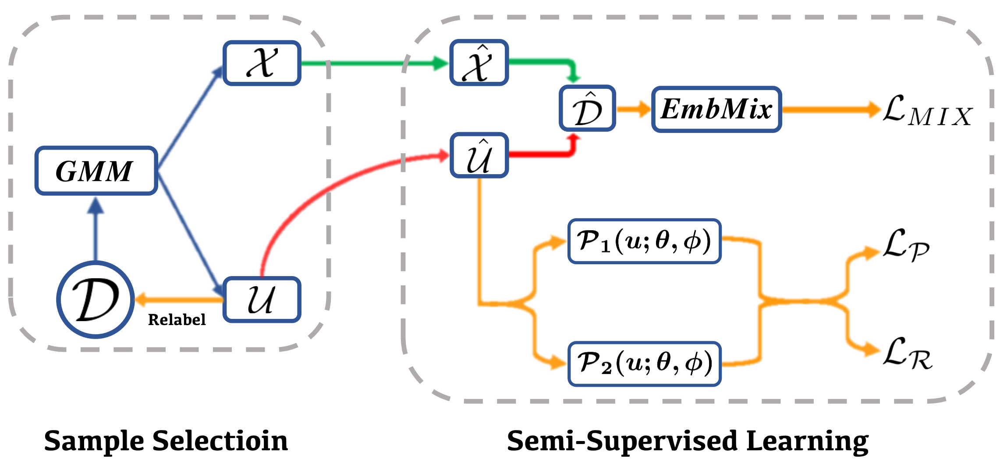

# SelfMix: Robust Learning Against Textual Label Noise with Self-Mixup Training

## Abstract

In real-world applications, label noise inevitably exists in training data, and deep neural models constructed from such data impede their effectiveness, robustness, and generalization ability. Recently, remarkable achievements have been made to mitigate this dilemma in visual data, while only a few explore textual data. To fill this gap, we present SelfMix, a simple yet effective method, to handle label noise in text classification tasks. SelfMix uses the Gaussian Mixture Model to separate samples and leverage semi-supervised learning by erasing the original labels that are most likely wrong. Unlike previous works that use multiple models to learn from each other, our methods utilize the dropout mechanism on a single model to reduce the confirmation bias in self-training and introduce a textual level mixup training strategy. Experimental results on three text classification benchmarks with different types of text show that the performance of our proposed methods outperforms these strong baselines designed for both textual and visual data under different noise ratios.

## Illustration


## Environment

1. python 3.6
2. torch
3. transformers
4. sklearn

## Experiments

We do experiments on three text classification benchmarks of different types, including Trec: a question-type dataset, AG-News: a news categorization dataset, and IMDB: a sentiment analysis dataset. The folder already has the Trec dataset to test, and you can download others yourself. Please process label to id (start from 0).

You can run the model through

```bash
bash train.sh
```

For different datasets, we recommend using hyperparameters as follows.

| Dataset  | Trec | AG-News | IMDB |
| -------- | ---- | ------- | ---- |
| lambda_r | 0.3  | 0.3     | 0.5  |
| lambda_p | 0.2  | 0.2     | 0.1  |

